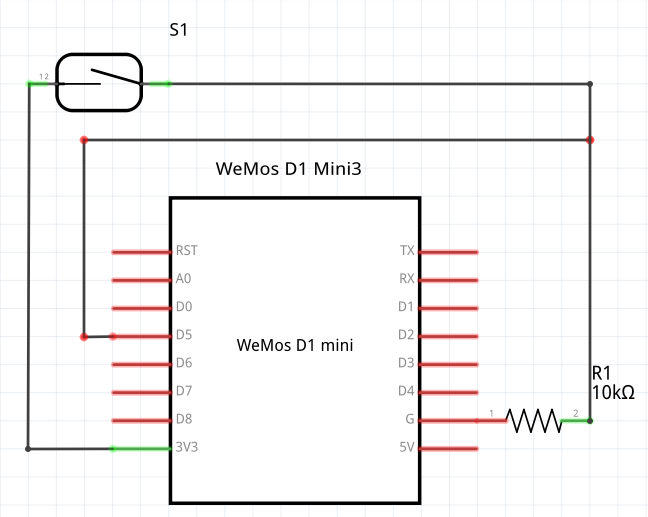
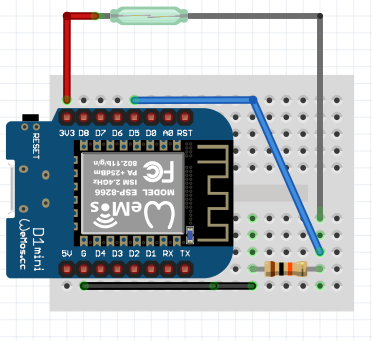
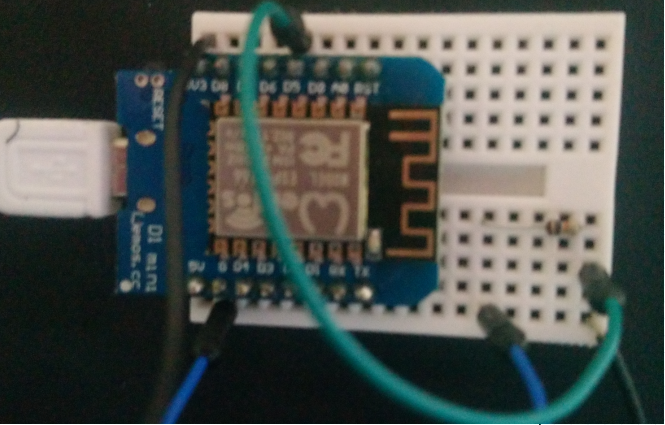

# wemos-close-to-scan
Use a Wemos to monitor if the lid is open or closed on a network scanner.

## History

In episode [hpr2430 :: Scanning books](http://hackerpublicradio.org/eps.php?id=2430), I had a bash file trigger a network scan. This required two steps, one to close the lid and the next to press a key for [scantoimage.bash](scantoimage.bash) to trigger the next page of the scan.

In the intervening time I looked at several solutions to improve this situation. 

The most obvious step was to put a magnetic switch on the scanner lid so that a device could detect the lid been closed.

I tried a Raspberry PI but my scanner drivers are only available for Intel and not Arm. Then then accessing the pi using Remote GPIO, but it got very complex to setup and run. 

Inspired by [hpr3077 :: Video conference Push to Talk](http://hackerpublicradio.org/eps.php?id=3077) Hosted by DanNixon on 2020-05-19, I tried using an arduino talking over serial to a Intel Compute Stick. But that was very flakey.

## Hardware

Finally I settled on using a <a href="https://www.wemos.cc/en/latest/d1/d1_mini.html">Clone of LOLIN D1 mini</a>, and some Reed Contacts.

- <a href="https://www.amazon.co.uk/gp/product/B071S8MWTY">Makerfire D1 Mini NodeMcu 4M Bytes Lua WIFI Development Board Base on ESP8266 ESP-12F N Compatible NodeMcu Arduino</a>
- https://www.digikey.com/en/products/detail/zf-electronics/MP201801/361987
- https://switches-sensors.zf.com/us/product/magnetic-position-sensor-mp2018/
- <a href="https://www.conrad.nl/p/zf-mp201801-reedcontact-1x-no-175-vdc-175-vac-500-ma-10-w-276124">ZF MP201801 Reedcontact 1x NO 175 V/DC, 175 V/AC 500 mA 10 W</a>
- <a href="https://www.conrad.nl/p/zf-as201801-bedienmagneet-voor-reedcontact-276116">ZF AS201801 Bedienmagneet voor reedcontact</a> 

## Wiring

Wire one end of the reed contact to 3.3v, and the other end to ground via a 10K resistor. 

Have a sensor wire go from the 10K resistor to pin D5 on the D1 Mini.

## Code 

### D1 Mini

See [wemos-close-to-scan.ino](wemos-close-to-scan.ino)

### Laptop

See [wemos-scantoimage.bash](wemos-scantoimage.bash)

# Operation

1. Plug in D1 Mini and monitor the serial port to get it's IP Address. 
1. Change the `server="YOUR-WEMOS-IP-ADDRESS"` in [wemos-scantoimage.bash](wemos-scantoimage.bash) to the ip address.
1. Change the `image_path="/PATH/TO/YOUR/SCANS/" in [wemos-scantoimage.bash](wemos-scantoimage.bash) to where your want the files saved.
1. Close scanner and scan.

